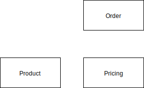

# Top Level Design



# Use cases

## Browse products

1. List all products
2. Select any product to see its details, including stocks in price

## Take order successfully

1. Select any product
2. Specify the quantity and add to cart
3. (Optional) repeat steps 1 and 2 for other products
4. Click checkout
5. Show summary of the order: items, quantity, total price
6. Make any modification to the quantity or remove items
7. (Optional) Add promo code, and display discounted price
8. Click proceed.
9. Enter payment details
10. Click pay
11. Show summary invoice and summary of the order

## Take order but cancelled by customer

1. Select any product
2. Specify the quantity and add to cart
3. Click checkout
4. Show summary of the order: items, quantity, total price
5. Click cancel to clear all items in the cart

# Development

## Design decisions

```
Using node 8 which supports native async await and many ES6 features such as const.

Avoid transpilation for libraries such as packages/price-calculator
```
